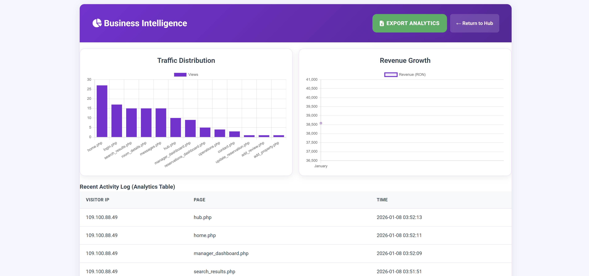
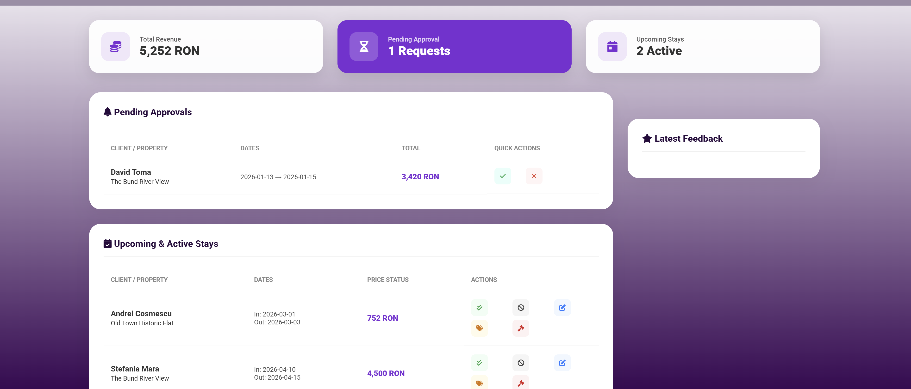
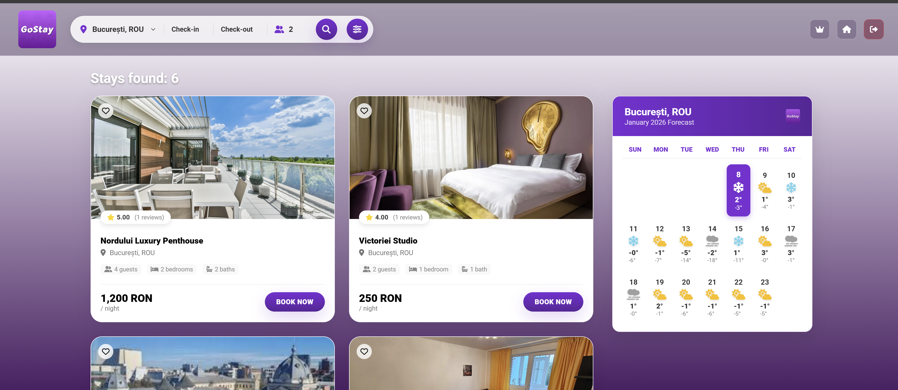

<p align="center">

</p>

<p align="center">      </p>


# 🏨 GoStay – Web Booking Platform

**GoStay** is a marketplace platform designed to connect travelers with exclusive property listings worldwide. The project emphasizes a seamless user experience, modular architecture, and high-security standards.

---

## 🔑 Key Features

### 🛡️ Authentication & Security

* **Dual Auth System**: Secure login and registration powered by AJAX (Fetch API).
* **Code Verification**: Two-step registration process featuring activation code simulation.
* **Security Layer**: Integrated protection against session hijacking and rigorous backend data validation.

### 📊 Analytics & Management

* **Real-time Tracker**: Custom middleware that monitors IP addresses and page traffic to identify visitor patterns.
* **Financial Hub**: Dedicated analytics dashboard tracking revenue growth and conversion rates.
* **Data Export**: Professional reporting system that generates Excel spreadsheets for financial analysis.

### ☁️ Search & Weather Integration

* **Intelligent Search**: Real-time filtering based on destination, guest count, and date availability.
* **Weather Widget**: 16-day localized forecast integration using the **Open-Meteo API**.
* **Dynamic Calendar**: Interactive booking system that visually blocks reserved dates using Flatpickr.

---

## 🛡️ Security Architecture and Data Integrity

The GoStay platform implements a multi-layered security protocol designed to mitigate common web vulnerabilities and ensure transactional integrity. At the database level, the system utilizes **PDO with strictly parameterized queries** to neutralize SQL Injection risks. User authentication is managed through high-entropy hashing using the **BCRYPT algorithm**, ensuring that sensitive credentials are never stored in plain text.

To prevent Cross-Site Scripting (XSS), all dynamic inputs undergo rigorous sanitization via HTML entity encoding and tag stripping before persistence or rendering. Furthermore, the application employs a transaction-based processing logic for complex operations, such as property registration, which ensures that database states remain consistent even in the event of partial execution failures. Access control is strictly enforced through role-based session validation, restricting administrative and managerial hubs to authorized personnel only.

---

## 🖥️ User Experience & Dashboards

| User Role | Dashboard Primary Function | Key Interface Elements | Interface Preview |
| --- | --- | --- | --- |
| **Admin** | **System Oversight** | Analytics graphs, User management, Database Hub |  |
| **Manager** | **Property Control** | Revenue tracking, Property CRUD, Booking management |  |
| **Client** | **Traveler Hub** | Interactive search, Messaging inbox, Personal reservations |  |

---

## 🛠️ Technical Stack

| Layer | Technologies |
| --- | --- |
| **Frontend** | HTML5, CSS3 (Flexbox/Grid), JavaScript (ES6+), FontAwesome 6 |
| **Backend** | PHP 8.2 (Modular Logic), **PDO (MySQL)** with Prepared Statements |
| **Database** | MySQL (Relational Schema: Cities ↔ Rooms ↔ Facilities ↔ Reservations) |
| **APIs** | Open-Meteo (Weather), Google Maps (Location), PHPMailer (Notifications) |

---

## 📁 Project Architecture

```text
source/
├── assets/                 # Static resources and media
│   └── uploads/            # Dynamic user content (Room photography & City icons)
│
└── scripts/                # Core Application Logic
    ├── auth/               # Security: Login, Signup, E-mail Verification
    ├── config/             # Environment: Singleton Database Connection
    ├── crud/               # Admin: Analytics, Hub Console, Excel Export
    ├── js/                 # Client-side: AJAX Auth and Real-time Pricing
    ├── models/             # OOP Data Objects: User and Room business logic
    ├── pages/              # View Controllers: Search, Chat, and Dashboards
    ├── sql/                # Data: SQL Schemas and Automated Triggers
    ├── styles/             # Design: Modular CSS for each UI component
    ├── support/            # Help: Contact forms and support ticket processing
    └── utils/              # Middleware: Tracker, Weather API, and Booking logic

```

---

## 🚀 Installation & Setup

1. **Database Import**:

* Create a new MySQL database named `gostay`.
* Import `source/scripts/sql/schema.sql` to generate the table structure.
* Import `source/scripts/sql/triggers.sql` for automated data handling.

2. **Configuration**:

* Update `source/scripts/config/database.php` with your local database credentials.

3. **Email Setup**:

* Configure your SMTP credentials in `source/scripts/auth/signup.php` to enable PHPMailer.

---
